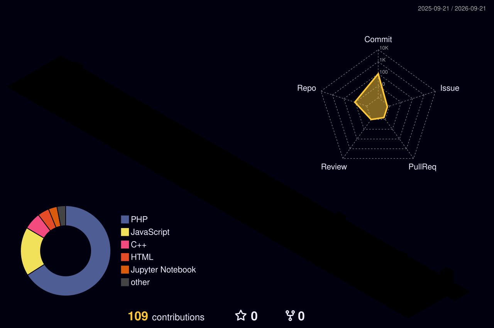

<div align="center">
  
</div>

<div align="center">
  <a href="https://linkedin.com/in/bgq1011"></a>
  
  
  
</div>



## `01` WHO AM I

```console
$ whoami --verbose

USER ............. GIA QUYEN
ROLE ............. Business Analyst
DIRECTION ........ IT Business Analyst
DOMAIN ........... requirements engineering · business process analysis
METHOD ........... Agile / Scrum · structured analysis · continuous validation
MISSION .......... translate business intent into systems that actually ship
```

I work at the seam between **business problems** and **technical solutions** — turning
ambiguous stakeholder needs into precise, testable, buildable specifications.

My working model is simple: **ask until it is unambiguous, model until it is
obvious, specify until it is testable.** A requirement that cannot be verified is
not a requirement — it is a wish.

- **Elicit** the real need, not the stated request — root cause over symptom
- **Model** processes and behaviour visually before a single line is written
- **Specify** with acceptance criteria so "done" is never a matter of opinion
- **Validate** continuously — the feedback loop is part of the design, not an afterthought

> `// TODO:` *Replace this line with your own one-sentence positioning statement.*


## `02` BA SYSTEM / CORE CAPABILITIES

```console
$ systemctl status ba-core.service --all
```

| MODULE | CAPABILITY | STATE |
|:---|:---|:---|
| `requirement.elicitation` | Interviews, workshops, questionnaires, document analysis, observation | 🟢 `ONLINE` |
| `requirement.analysis` | Prioritisation (MoSCoW), traceability, conflict + gap resolution | 🟢 `ONLINE` |
| `stakeholder.management` | Mapping, RACI, expectation alignment, structured communication | 🟢 `ONLINE` |
| `process.analysis` | As-is / to-be modelling, bottleneck detection, process optimisation | 🟢 `ONLINE` |
| `process.modeling.bpmn` | BPMN 2.0 process diagrams, swimlanes, event flows | 🟢 `ONLINE` |
| `system.modeling.uml` | Use case, activity, sequence, class and state diagrams | 🟢 `ONLINE` |
| `spec.authoring` | BRD, SRS, FRD, user stories, use cases, acceptance criteria | 🟢 `ONLINE` |
| `agile.delivery` | Backlog refinement, sprint ceremonies, story slicing, definition of done | 🟢 `ONLINE` |
| `data.analysis.sql` | Querying, joins, aggregation, data validation and reconciliation | 🟡 `TRAINING` |
| `api.analysis` | Endpoint contracts, request/response validation, integration mapping | 🟡 `TRAINING` |


## `03` BA TOOLKIT

```console
$ ls -la ~/toolkit/
```

```text
├── ANALYSIS & MODELING
│   ├── BPMN 2.0 ................ business process modelling notation
│   ├── UML ..................... use case · activity · sequence · class
│   ├── Draw.io ................. diagramming and process maps
│   └── Figma ................... wireframes · UI flow · prototype review
│
├── DOCUMENTATION & SPECIFICATION
│   ├── BRD / SRS / FRD ......... formal requirement documentation
│   ├── User Stories + AC ....... Given / When / Then criteria
│   ├── Use Cases ............... actor · precondition · main + alt flows
│   └── Confluence .............. knowledge base and living specs
│
├── DELIVERY & TRACKING
│   ├── Jira .................... backlog · sprint · issue traceability
│   ├── Agile / Scrum ........... iterative delivery framework
│   └── Git / GitHub ............ version control and collaboration
│
└── DATA & VALIDATION
    ├── SQL ..................... data querying and verification
    ├── Postman ................. API request testing and contract checks
    ├── Excel ................... analysis · matrices · pivot reporting
    └── Power BI ................ dashboards and data storytelling
```

<div align="center">
  
  
  
  
  
  
  
  
  
  
  
</div>


## `04` ANALYSIS PIPELINE

<div align="center">
  
</div>

```console
$ trace requirement --id REQ-001 --follow

[01] ELICIT   → stakeholder interview logged, raw need captured
[02] ANALYZE  → as-is mapped, gap identified, root cause isolated
[03] MODEL    → BPMN to-be flow + UML use case produced
[04] SPECIFY  → user story written, acceptance criteria attached
[05] VALIDATE → UAT scenario executed, sign-off obtained
[06] SUPPORT  → feedback captured, routed back to [01]

TRACE COMPLETE — 0 orphaned requirements
```


## `05` ACTIVE PROJECTS

```console
$ ps aux | grep project
```

<!--
  ┌──────────────────────────────────────────────────────────────────────┐
  │  PLACEHOLDER SECTION — replace the rows below with your own work.    │
  │  Nothing here is real yet. Keep the format; swap the content.        │
  └──────────────────────────────────────────────────────────────────────┘
-->

| PID | PROJECT | SCOPE | ARTEFACTS | STATE |
|:---|:---|:---|:---|:---|
| `0001` | *`<project-name>`* | *`<what business problem it solves>`* | *`<BRD / BPMN / user stories>`* | 🟢 `RUNNING` |
| `0002` | *`<project-name>`* | *`<scope in one line>`* | *`<artefacts produced>`* | 🟡 `ANALYSIS` |
| `0003` | *`<project-name>`* | *`<scope in one line>`* | *`<artefacts produced>`* | ⚪ `QUEUED` |

> `// PLACEHOLDER:` **Replace the three rows above with real projects, case
> studies, or BA practice repositories.** Delete any row you do not need.
> Nothing above describes real experience — it is scaffolding for you to fill in.


## `06` TECHNICAL SKILLS

```console
$ cat ~/.config/skills.conf
```

```ini
[analysis]
requirement_gathering   = interviews, workshops, document analysis, observation
requirement_analysis    = prioritisation, traceability, gap + conflict resolution
business_process        = as-is / to-be, bottleneck detection, optimisation
stakeholder_management  = mapping, RACI, alignment, structured reporting

[modeling]
bpmn                    = 2.0 process diagrams, swimlanes, event flows
uml                     = use case, activity, sequence, class, state
wireframing             = Figma, Draw.io

[specification]
documents               = BRD, SRS, FRD
agile_artefacts         = user stories, acceptance criteria, use cases
definition_of_done      = testable, traceable, unambiguous

[technical]
sql                     = SELECT, JOIN, GROUP BY, subqueries, data validation
api_analysis            = REST contracts, JSON payloads, status codes, auth flow
tools                   = Postman, Jira, Confluence, Excel, Power BI, Git

[methodology]
frameworks              = Agile, Scrum, Waterfall (context-dependent)
ceremonies              = refinement, planning, review, retrospective

[languages]
# PLACEHOLDER — set your actual proficiency levels
vietnamese              = <level>
english                 = <level>
```

> `// PLACEHOLDER:` *Fill in the `[languages]` block and add certifications
> below only once you actually hold them (e.g. IIBA ECBA/CCBA, PSPO, PSM).*


## `07` GITHUB TELEMETRY

<div align="center">
  
</div>

<sub>`AUTO-GENERATED` — rebuilt daily by [`update-profile.yml`](.github/workflows/update-profile.yml) via [`scripts/generate-metrics.js`](scripts/generate-metrics.js). Do not edit `dist/metrics.svg` by hand.</sub>


## `08` CONTRIBUTION ACTIVITY

<div align="center">
  
</div>

<details>
<summary><b><code>▸ EXPAND 3D CONTRIBUTION GRAPH</code></b></summary>
<br />
<div align="center">
  
</div>
<sub>Generated by <a href="/.github/workflows/profile-3d.yml"><code>profile-3d.yml</code></a>. Renders after the workflow's first successful run.</sub>
</details>


## `09` CONNECT

```console
$ ./open_channel --secure

CHANNEL ......... OPEN
LATENCY ......... LOW
LOOKING FOR ..... IT Business Analyst opportunities · BA collaboration
BEST TOPIC ...... requirements, process modelling, spec writing
```

<div align="center">
  <a href="https://linkedin.com/in/bgq1011"></a>
  <a href="https://twitter.com/bbuigiaquyen"></a>
  <a href="https://facebook.com/bbuigiaquyen"></a>
  <a href="https://instagram.com/bbuigiaquyen"></a>
</div>

<div align="center">
  <br />
  <sub><code>// PLACEHOLDER — add a contact email or portfolio link here if you want one public.</code></sub>
</div>


<div align="center">
  <br />
  <code>SESSION ACTIVE</code> · <code>REQUIREMENTS ENGINE RUNNING</code> · <code>AWAITING NEXT PROBLEM</code>
  <br /><br />
  <sub>Built as a system, not a résumé. Assets in <a href="/assets/"><code>assets/</code></a> are original SVG — no external image services.</sub>
</div>
