<div align="center">
  

  <!-- 1. HERO — MATRIX RAIN & IDENTITY -->
  

  <br/>

  <!-- 2. POSITIONING -->
  <p align="center">
    <strong>IT Business Analyst</strong> &bull; Requirements Engineering &amp; Business Process Analysis<br/>
    <sub>Translating ambiguous business intent into precise, testable, buildable specifications.</sub>
  </p>

  <br/>

  <!-- 3. SYSTEM LOG TYPING -->


<br/><br/>

  <!-- 4. STATUS BADGES -->
  
  &nbsp;
  
  &nbsp;
  

<br/><br/>

<a href="https://linkedin.com/in/bgq1011"></a>
&nbsp;


</div>


## WHO AM I ?

> _"A requirement that cannot be verified is not a requirement — it is a wish."_

Hey, I'm **Gia Quyen** — a Business Analyst working toward **IT Business Analyst**, based in Vietnam.

I work at the seam where **business problems meet technical solutions**: turning vague
stakeholder needs into specifications a team can actually build against.

My working model is simple — **ask until it is unambiguous, model until it is obvious,
specify until it is testable.**

- **Elicit** the real need, not the stated request — root cause over symptom.
- **Model** processes and behaviour visually before a single line of code is written.
- **Specify** with acceptance criteria so "done" is never a matter of opinion.
- **Validate** continuously — the feedback loop is part of the design, not an afterthought.

> `// TODO:` _Add your own one-sentence positioning statement here._


## ANALYSIS CONSOLE

<div align="center">
  
</div>


## LOADED MODULES

<table width="100%">
  <tr>
    <td width="18%" valign="middle"><strong>ELICITATION</strong></td>
    <td width="82%" valign="middle">
      
      
      
      
      
    </td>
  </tr>
  <tr>
    <td width="18%" valign="middle"><strong>ANALYSIS</strong></td>
    <td width="82%" valign="middle">
      
      
      
      
      
    </td>
  </tr>
  <tr>
    <td width="18%" valign="middle"><strong>MODELING</strong></td>
    <td width="82%" valign="middle">
      
      
      
      
      
      
    </td>
  </tr>
  <tr>
    <td width="18%" valign="middle"><strong>SPECIFICATION</strong></td>
    <td width="82%" valign="middle">
      
      
      
      
      
    </td>
  </tr>
  <tr>
    <td width="18%" valign="middle"><strong>DELIVERY</strong></td>
    <td width="82%" valign="middle">
      
      
      
      
      
    </td>
  </tr>
  <tr>
    <td width="18%" valign="middle"><strong>DATA</strong></td>
    <td width="82%" valign="middle">
      
      
      
      
      
      
      <br/>
      
    </td>
  </tr>
</table>


## CORE CAPABILITIES

```console
$ systemctl status ba-core.service --all
```

| MODULE                    | CAPABILITY                                                               | STATE         |
| :------------------------ | :----------------------------------------------------------------------- | :------------ |
| `requirement.elicitation` | Interviews, workshops, questionnaires, document analysis, observation    | 🟢 `ONLINE`   |
| `requirement.analysis`    | Prioritisation (MoSCoW), traceability, conflict + gap resolution         | 🟢 `ONLINE`   |
| `stakeholder.management`  | Mapping, RACI, expectation alignment, structured communication           | 🟢 `ONLINE`   |
| `process.analysis`        | As-is / to-be modelling, bottleneck detection, process optimisation      | 🟢 `ONLINE`   |
| `process.modeling.bpmn`   | BPMN 2.0 process diagrams, swimlanes, event flows                        | 🟢 `ONLINE`   |
| `system.modeling.uml`     | Use case, activity, sequence, class and state diagrams                   | 🟢 `ONLINE`   |
| `spec.authoring`          | BRD, SRS, FRD, user stories, use cases, acceptance criteria              | 🟢 `ONLINE`   |
| `agile.delivery`          | Backlog refinement, sprint ceremonies, story slicing, definition of done | 🟢 `ONLINE`   |
| `data.analysis.sql`       | Querying, joins, aggregation, data validation and reconciliation         | 🟡 `TRAINING` |
| `api.analysis`            | Endpoint contracts, request/response validation, integration mapping     | 🟡 `TRAINING` |


## ANALYSIS PIPELINE

<div align="center">
  
</div>

```console
$ trace requirement --id REQ-001 --follow

[01] ELICIT   → stakeholder interview logged, raw need captured
[02] ANALYZE  → as-is mapped, gap identified, root cause isolated
[03] MODEL    → BPMN to-be flow + UML use case produced
[04] SPECIFY  → user story written, acceptance criteria attached
[05] VALIDATE → UAT scenario executed, sign-off obtained
[06] SUPPORT  → feedback captured, routed back to [01]

TRACE COMPLETE — 0 orphaned requirements
```


## SKILL CONFIG

```ini
[analysis]
requirement_gathering   = interviews, workshops, document analysis, observation
requirement_analysis    = prioritisation, traceability, gap + conflict resolution
business_process        = as-is / to-be, bottleneck detection, optimisation
stakeholder_management  = mapping, RACI, alignment, structured reporting

[modeling]
bpmn                    = 2.0 process diagrams, swimlanes, event flows
uml                     = use case, activity, sequence, class, state
wireframing             = Figma, Draw.io

[specification]
documents               = BRD, SRS, FRD
agile_artefacts         = user stories, acceptance criteria, use cases
definition_of_done      = testable, traceable, unambiguous

[technical]
sql                     = SELECT, JOIN, GROUP BY, subqueries, data validation
api_analysis            = REST contracts, JSON payloads, status codes, auth flow
tools                   = Postman, Jira, Confluence, Excel, Power BI, Git

[methodology]
frameworks              = Agile, Scrum, Waterfall (context-dependent)
ceremonies              = refinement, planning, review, retrospective

[languages]
vietnamese              = native
english                 = TOEIC (expected)

[certifications]
BeBA certification of complete trainning course
```




## CONNECT

```console
$ ./open_channel --secure

CHANNEL ......... OPEN
LATENCY ......... LOW
LOOKING FOR ..... IT Business Analyst opportunities · BA collaboration
BEST TOPIC ...... requirements, process modelling, spec writing
```

<div align="center">
  <a href="https://linkedin.com/in/bgq1011"></a>
  <a href="https://twitter.com/bbuigiaquyen"></a>
  <a href="https://facebook.com/bbuigiaquyen"></a>
  <a href="https://instagram.com/bbuigiaquyen"></a>
  <br /><br />
</div>


<div align="center">
  <br />
  
  <br /><br />
  <code>SESSION ACTIVE</code> · <code>REQUIREMENTS ENGINE RUNNING</code> · <code>AWAITING NEXT PROBLEM</code>
  <br /><br />
</div>
